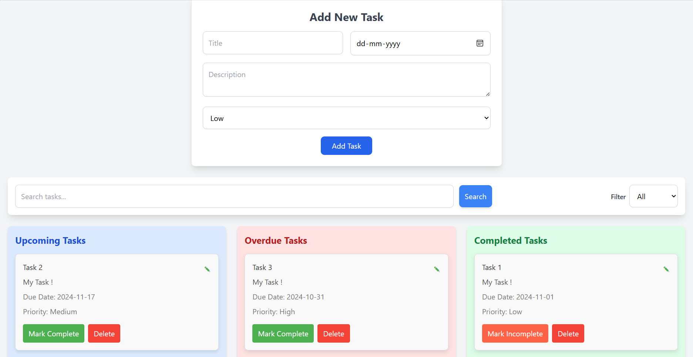

# Simple Task Manager

## Project Overview

The Simple Task Manager is a lightweight task management application designed for managing tasks with core functionalities such as adding, editing, deleting, and prioritizing tasks. It offers a straightforward, user-friendly interface for organizing tasks based on urgency, due dates, and completion status.

## Preview



## Features

1. **Dashboard**  
   - View a list of tasks categorized by upcoming, overdue, and completed.
   
2. **Task Management**  
   - Add, edit, and delete tasks with details like title, description, due date, and priority.
   
3. **Priority Levels**  
   - Assign tasks one of three priority levels: High, Medium, or Low.
   
4. **Search and Filter**  
   - Search for tasks by title or description.
   - Filter tasks based on priority level and completion status.

## Technical Details

- **Frontend**: React (or Vanilla JavaScript as per requirements)
- **Data Storage**: Local Storage (or Session Storage) to keep tasks persistent on the browser.
- **Styling**: TailwindCSS (or custom CSS) for a clean, responsive UI.

## Setup Instructions

### Prerequisites

Ensure you have the following installed:
- [Node.js](https://nodejs.org/) (version 14 or later)
- npm (Node Package Manager)

### Installation

1. Clone the repository:

   ```bash
   git clone https://github.com/priyanshupg/Noteable
   cd Noteable/Task_Manager_Elite_Fit
